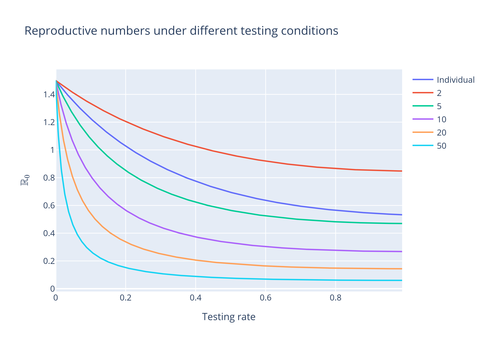

# Pool testing as a means of surveillance testing

I embedded a pool-testing mechanism within an $SEIR$ model in order to test pool testing's efficacy at surveillance testing, that is its ability to find infections among the population before enough had accumulated to cause an outbreak. This was inspired by China's ability to test millions of people within two weeks to find a handful of infected in Qingdao. The mechanism was chosen to be as simple as possible: if an infectious person, that is someone from compartment $I$, is present in the pool, then the pool returns a positive result. This kept a handle on the model complexity while also allowing for false negatives as pools with individuals who were infected but not yet infectious (called latent and in compartment $E$) would return a negative result. Individuals continued to mix with the general population while they awaited the results of their pool test. Upon receiving a positive pool test result, individuals were immediately isolated and tested individually. They remained isolated until a result was returned, which we assumed had perfect accuracy. If the result was positive, they were quarantined while a negative result released them. 

Simplifying but unrealistic assumptions were made about times spent waiting for made about the times spent waiting for test results and the time spent in quarantine. We assumed that they were all exponentially distributed. As tests take time to process, it's unrealistic to think anyone would get an instantaneous result yet our choice in the exponential distribution would imply that was the most common time take for a test result to be returned. The use of exponential distributions is a common assumption in infectious disease modelling due to their simplicity but does imply that results from these models should be retested with distributions that are more realistic.

The two main variables that were focused on was the size of the pools and the turnabouts times. As seen below, increasing the size of the pools greatly reduced the basic reproductive number, indicating a reduced ability for an infectious agent to invade a population:

