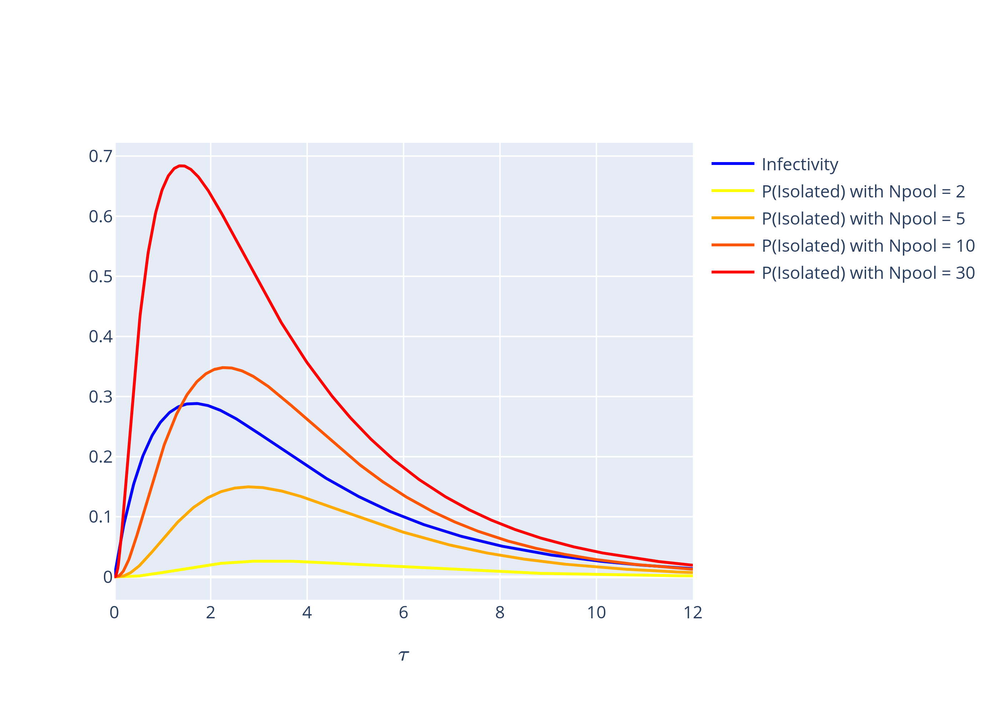
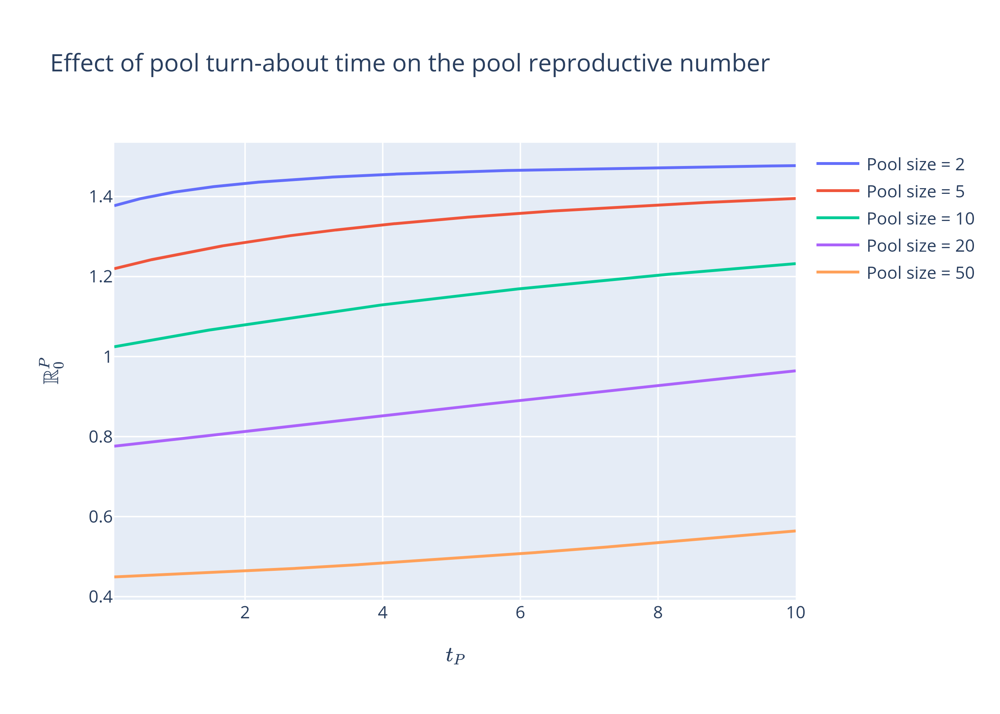
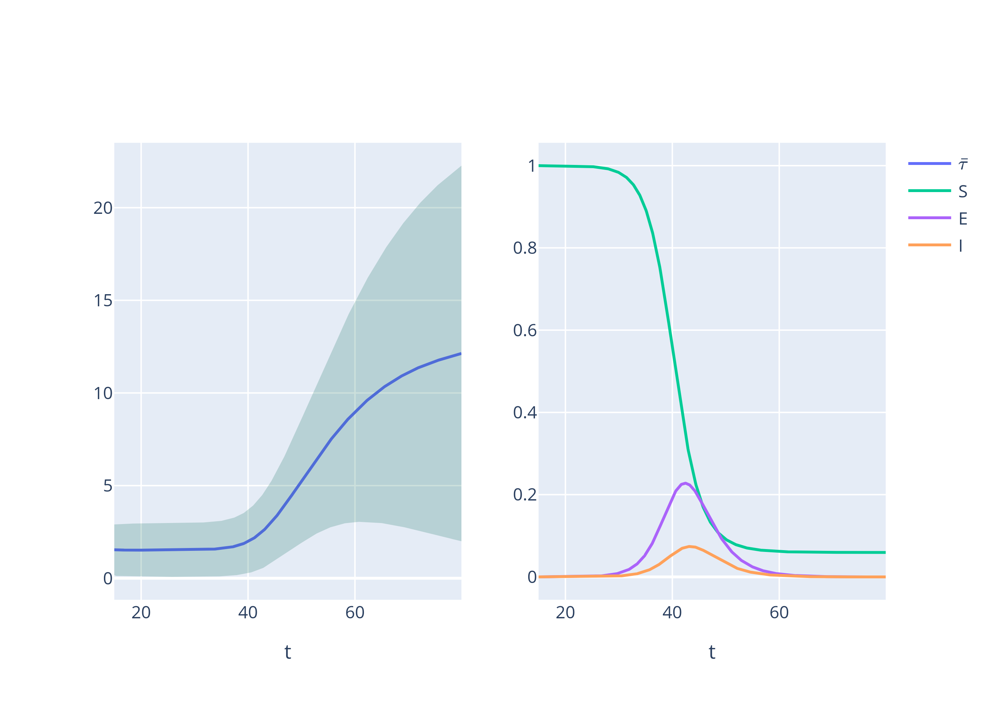
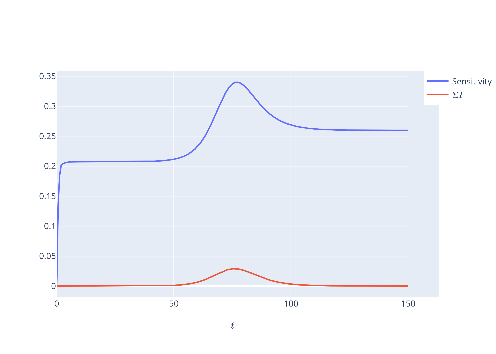

# PhD Project: Pool testing as a means of surveillance testing

I embedded a pool-testing mechanism within an $SEIR$ model to understand when such an intervention could prevent an outbreak. This was inspired by China's ability to test millions of people within two weeks to find a handful of infected in Qingdao. The mechanism was simple: the pool returns a positive result if it contains an infectious person, that is someone from compartment $I$. This allowed for false negatives as pools whose infected individuals were all from the latent compartment $E$, that is who were infected but not yet infectious, would return a negative result. Individuals continued to mix with the general population while they awaited the result of their pool test. Upon receiving a positive result, individuals were immediately isolated and tested individually. They remained isolated until a result was returned, which we assumed had perfect accuracy. If the result was positive, they were quarantined while a negative result released them. 

Simplifying but unrealistic assumptions were made about the turnabout times, which are the times required for test results to be returned. We assumed that they were exponentially distributed. As tests take time to process, it's unrealistic to think anyone would instantaneously receive their result yet our choice in the exponential distribution implied that was the most common experience among the tested. 

The focus of this project was the effect of the pool size and the turnabout times. As seen below, larger pool sizes greatly reduced the basic reproductive number for a given testing rate, indicating a reduced ability for an infectious agent to invade a population:

Testing reduces spread by removing individuals from the population during their infectious period. We found that when larger pool sizes were used, infected individuals were more likely to be isolated when they were infectious as the plot indicates below. The blue curve is a person's expected infectiousness at age-of-infection $\tau$ where age-of-infection is how long they have been infected for:

Increasing the pool-test turnabout time $t_P$ reduced the effectiveness of the testing regime but not starkly. This surprised me as I thought that if results were returned quicker, then the infected would be isolated sooner leading to a large reduction in propagation. I don't have a good reason why this isn't the case but I suspect it is related to the assumption that the times spent in the latent and infectious stage as well as the pool-test turnabout times were exponentially distributed. Previous studies have found that such an assumption can affect the performance of modelled interventions:

An observation had been made in another paper that the pool-testing sensitivity, which is the probability that a pool will return positive given that it contains at least one infected person, spiked around when the epidemic was at its peak. The reason for this is intuitive: false negatives occur when the viral loads of those contained within the pool are too low to be detected. Members of the infected population during the beginning of an epidemic tend to have been infected recently due to the exponential growth in infections and thus have low viral loads as their viral populations haven't yet attained their apex. Similarly as an epidemic peters out, members of the infected population tend to have been infected for a long time, leaving them with decayed viral populations. Below is a plot of the average age-of-infection $\bar{\tau}$ as an epidemic $SEIR$ epidemic progresses. We see that $\bar{\tau}$ is low and constant during the exponential growth phase of the epidemic after which it starts to rise:

 Thus it is in between these two phases of an epidemic that a pool is most likely to have members with high viral loads. The original paper that observed this simulated the viral loads of an entire population and looked at what happened to pools constructed from said population. My model offered no such granularity and yet the simple rule that infectious individuals return positive pools while latent individuals do not was sufficient replicate the phenomenon:

 

